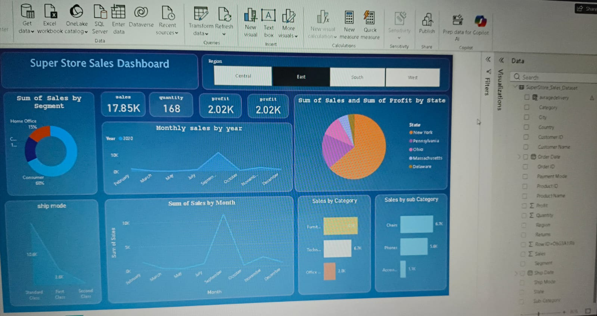

# Superstore Sales Analysis Dashboard (Power BI)

Sales Analysis Dashboard built using Power BI with DAX and Power Query.

This project presents an interactive sales dashboard created using Power BI to analyze sales performance and business insights.

## KPIs
- Total Sales
- Profit Percentage
- Monthly Growth
- Top Performing Regions
- Customer Segments

## Tools Used
- Power BI
- DAX
- Power Query

## Dashboard Preview
See the dashboard screenshot in this repository.
